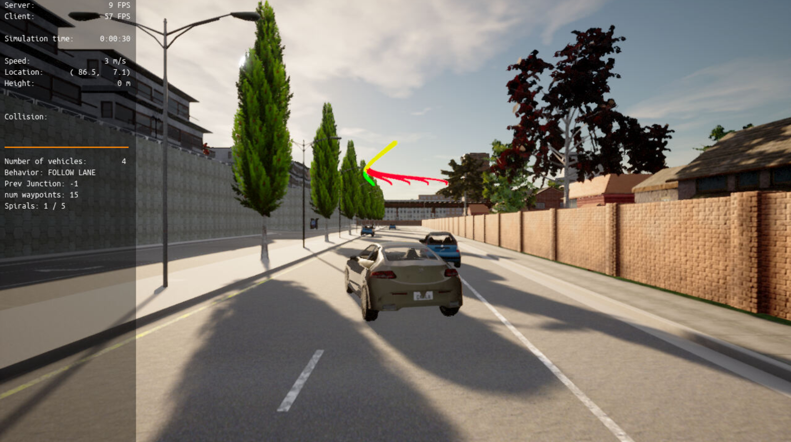

# Motion Planning and Decision Making for Autonomous Vehicles

This is the project for the fourth course in the Udacity Self-Driving Car Engineer Nanodegree Program: Planning

## Run and compile the code
```
su - student
// Will say permission denied, ignore and continue 
cd /opt/carla-simulator/
SDL_VIDEODRIVER=offscreen ./CarlaUE4.sh -opengl

```

New terminal window
```
cd project
./install-ubuntu.sh
cd starter_files/
cmake .
make
cd ..
./run_main.sh
```

## Results
The goal of the project was to implement two of the main components of a traditional hierarchical planner: The Behaviour Planner and the Motion Planner.     
The following image shows the result of the CARLA simulation, where 5 different paths are calculated. The best path is marked green.




